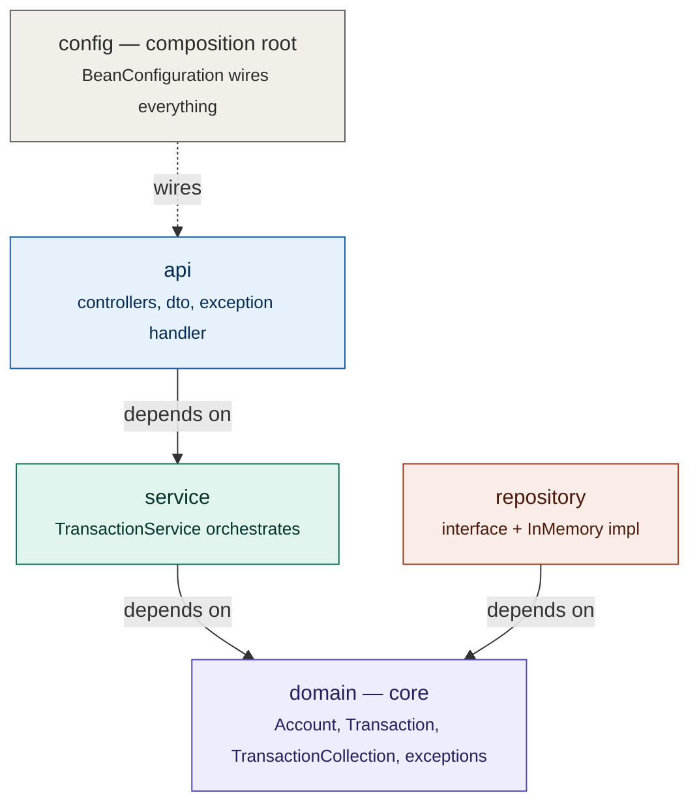
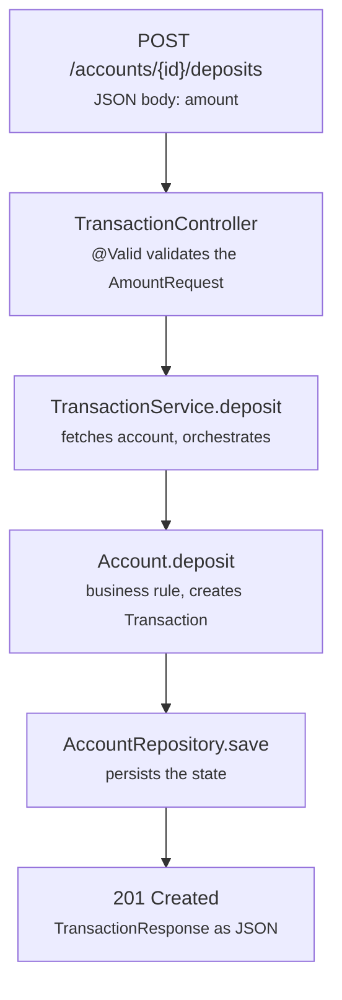

# Java Foundation Lab

A study project implementing the core of a banking system — accounts, transactions,
and transfers — exposed through a REST API. Built to demonstrate clean architecture,
domain modeling, and solid testing practices in Java.

## Overview

The system allows opening accounts, depositing, withdrawing, transferring funds
between accounts, and checking balances. The emphasis is not on the features
themselves but on *how* they were built: separation of concerns, immutability where
it makes sense, dependency inversion, and a test suite that covers everything from
the domain to the web layer.

## Stack

- **Java 25**
- **Spring Boot 4.1** (Spring Framework 7)
- **Maven** as the build tool
- **JUnit 5** and **Mockito** for testing
- **MockMvc** and **RestTestClient** for web-layer tests

## Architecture

The project follows a layered architecture influenced by Domain-Driven Design and
the Ports & Adapters style. The core principle is the **dependency rule**: outer
layers depend on inner layers, never the other way around. The domain is the core
and knows nothing above it.

All arrows point toward the domain. The core depends on no other layer — it could be
extracted into a standalone library without changes.

### Package structure

    com.paymentengine
    ├── Application            Spring Boot entry point
    ├── config                 composition root (BeanConfiguration)
    ├── api                    HTTP boundary
    │   ├── controller         AccountController, TransactionController, GlobalExceptionHandler
    │   └── dto                request/response objects
    ├── domain                 business core
    │   ├── model              Account, Transaction, TransactionCollection, enums
    │   └── exception          domain exception hierarchy
    ├── repository             AccountRepository (port) + InMemoryAccountRepository (adapter)
    └── service                TransactionService (use-case orchestration)

### Why the layers are organized this way

- **`domain`** is the center. It holds the business rules and imports nothing from
  frameworks or outer layers.
- **`repository`** defines a *port* (the `AccountRepository` interface) and provides
  an *adapter* (`InMemoryAccountRepository`). The service depends on the interface,
  not the implementation — swapping in a JDBC/JPA version wouldn't require changing
  the service.
- **`service`** orchestrates: it fetches aggregates, asks them to perform operations,
  and persists the result. It holds no business rules — those live in the domain.
- **`api`** translates HTTP into use-case calls, using DTOs to decouple the API
  contract from the internal structure of the domain.
- **`config`** is the composition root: the single place that decides which concrete
  implementations to wire together.

## Request flow

The path of a deposit, from HTTP to persistence and back:

The business rule (validating the amount, changing the balance) lives in `Account`,
not in the service or the controller. The controller only translates HTTP; the
service only orchestrates. Each layer has a single responsibility.

## Applied patterns and concepts

- **Aggregate Root** — `Account` controls access to its transactions and protects
  its invariants (the balance only changes through `deposit`/`withdraw`).
- **Value Object** — `TransactionCollection` is immutable, has no identity of its
  own, and offers a fluent, composable API (`collection.approved().topByAmount(5)`).
- **Repository Pattern** — persistence abstracted behind an interface that speaks
  the domain's language.
- **Dependency Injection / Inversion of Control** — Spring injects dependencies;
  `BeanConfiguration` keeps the domain free of framework annotations.
- **DTO** — transfer objects separate the HTTP boundary from the domain.
- **Factory Method** — `AccountResponse.from(...)`, `AccountNotFoundException.forId(...)`.
- **Centralized exception handling** — `@RestControllerAdvice` translates domain
  exceptions into semantic HTTP statuses.

## API endpoints

| Method | Route                        | Description               | Success status |
|--------|------------------------------|---------------------------|----------------|
| POST   | `/accounts`                  | Open an account           | 201 Created    |
| GET    | `/accounts/{id}`             | Get an account            | 200 OK         |
| POST   | `/accounts/{id}/deposits`    | Deposit into an account   | 201 Created    |
| POST   | `/accounts/{id}/withdrawals` | Withdraw from an account  | 201 Created    |
| POST   | `/transfers`                 | Transfer between accounts | 200 OK         |

### Error mapping

Business errors are translated into semantic HTTP statuses by the
`GlobalExceptionHandler`, with a consistent `ErrorResponse` body:

| Situation                     | Exception                      | Status                    |
|-------------------------------|--------------------------------|---------------------------|
| Account not found             | `AccountNotFoundException`     | 404 Not Found             |
| Insufficient balance          | `InsufficientBalanceException` | 422 Unprocessable Content |
| Invalid transaction           | `InvalidTransactionException`  | 422 Unprocessable Content |
| Invalid input / same account  | validation / `IllegalArgument` | 400 Bad Request           |

### API design decisions

- **Transfer as its own resource** (`POST /transfers`) rather than a sub-resource of
  an account. A transfer is a symmetric operation between peers — neither account
  "owns" it.
- **Deposit and withdrawal as sub-resources** (`/accounts/{id}/deposits`) because
  each belongs to a single account.
- **422 vs 400** — `400` signals a malformed request; `422` signals a request that
  was understood but violates a business rule (e.g. insufficient balance).

## Testing

The suite covers all layers, with different strategies depending on the target:

- **Domain** — direct tests of the rules in `Account`, `Transaction`, and
  `TransactionCollection`.
- **Repository** — tests of the `AccountRepository` contract against the in-memory
  implementation.
- **Service** — tests with Mockito (isolating the repository) and integration tests
  with the real repository, verifying the end-to-end flow and balance conservation.
- **Web layer** — `AccountControllerTest` with **MockMvc** and
  `TransactionControllerTest` with **RestTestClient**, demonstrating both
  controller-testing approaches in Spring Boot 4. Both exercise the
  `GlobalExceptionHandler`.

## Running the project

Prerequisites: JDK 17 or higher and Maven (or use the `./mvnw` wrapper).

Compile and run the tests:

    mvn clean test

Start the application (port 8080):

    mvn spring-boot:run

### Usage examples

Open an account:

    curl -X POST http://localhost:8080/accounts \
      -H "Content-Type: application/json" \
      -d '{"customerId": "customer-001"}'

Deposit (use the id returned above):

    curl -X POST http://localhost:8080/accounts/{id}/deposits \
      -H "Content-Type: application/json" \
      -d '{"amount": 100.00}'

Check the balance:

    curl http://localhost:8080/accounts/{id}

Transfer between accounts:

    curl -X POST http://localhost:8080/transfers \
      -H "Content-Type: application/json" \
      -d '{"sourceAccountId": "{id1}", "targetAccountId": "{id2}", "amount": 25.00}'

## Known limitations and next steps

- **In-memory persistence** — data doesn't survive a restart. A natural next step
  would be a JDBC or JPA adapter implementing `AccountRepository`, without changing
  the service or the domain.
- **Transfer atomicity** — the implementation validates before mutating, but doesn't
  provide true ACID atomicity (guaranteed only by being synchronous and in-memory).
  In production, the transfer would be wrapped in a database transaction.
- **No authentication/authorization** — out of scope for this lab.