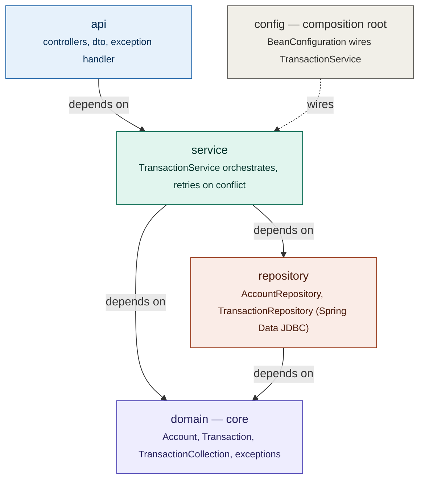
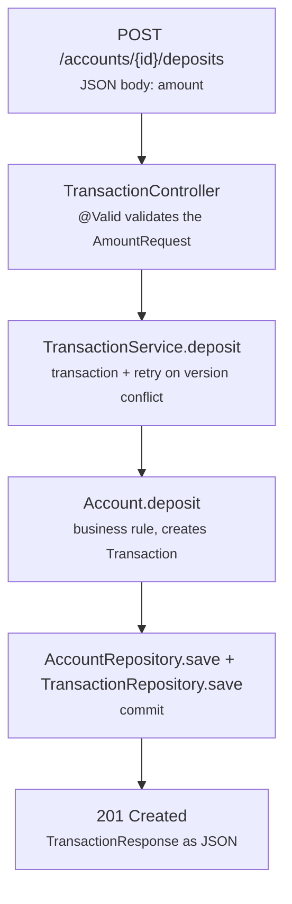

# Payment Authorization Engine

A project implementing the core of a banking system — accounts, transactions,
and transfers — exposed through a REST API. Built to demonstrate clean architecture,
domain modeling, concurrency control, and solid testing practices in Java.

## Overview

The system allows opening accounts, depositing, withdrawing, transferring funds
between accounts, and checking balances. The emphasis is not on the features
themselves but on *how* they were built: separation of concerns, immutability where
it makes sense, dependency inversion, safe behavior under concurrent writes, and a
test suite that covers everything from the domain to the web layer.

## Stack

- **Java 25**
- **Spring Boot 4.1** (Spring Framework 7)
- **Spring Data JDBC** with **H2** (in-memory database)
- **Maven** as the build tool
- **JUnit 5** and **Mockito** for testing
- **MockMvc** and **RestTestClient** for web-layer tests

## Architecture

The project follows a layered architecture influenced by Domain-Driven Design. The
core principle is the **dependency rule**: outer layers depend on inner layers,
never the other way around.

### Package structure

    com.paymentengine
    ├── Application            Spring Boot entry point
    ├── config                 composition root (BeanConfiguration)
    ├── api                    HTTP boundary
    │   ├── controller         AccountController, TransactionController, GlobalExceptionHandler
    │   └── dto                request/response objects
    ├── domain                 business core
    │   ├── model              Account, Transaction, TransactionCollection, enums
    │   └── exception          domain exception hierarchy
    ├── repository             AccountRepository, TransactionRepository (Spring Data JDBC)
    └── service                TransactionService (use-case orchestration)

### Design decisions

- **`Account` and `Transaction` are separate aggregates.** `Account` holds only its
  own state (id, customer, balance, version). `deposit` and `withdraw` return the
  resulting `Transaction`, and the service persists it through
  `TransactionRepository`. Loading an account never drags its full history along,
  and statement queries can later be done at the database level.
- **Repositories are Spring Data JDBC interfaces.** Domain classes carry light
  mapping annotations (`@Table`, `@Id`, `@Version`) and implement `Persistable`,
  because ids are generated in the constructor. This is a deliberate trade-off:
  less code than a hand-written adapter, at the cost of the domain knowing about
  the persistence mapping.
- **`TransactionService` is wired in `BeanConfiguration`,** not annotated as a
  Spring bean, and uses `TransactionTemplate` instead of `@Transactional`.
  `@Transactional` only works when Spring proxies the bean; `TransactionTemplate`
  behaves the same whether the service is built by Spring or by hand in a test.
- **`config` is the composition root,** the single place that decides how the
  service is assembled.

## Concurrency and consistency

- **Atomicity.** Each write operation runs in one database transaction. A transfer
  saves two accounts and two transaction records; either all four are committed or
  none are.
- **Optimistic locking.** `Account` has a `@Version` column. If two operations
  modify the same account concurrently, the second write is rejected with an
  `OptimisticLockingFailureException` instead of silently overwriting the first.
- **Retry.** On a version conflict, the service re-runs the whole operation in a
  fresh transaction, re-reading the account, up to 20 attempts. Genuinely
  concurrent requests therefore resolve against the latest committed state.
- **HTTP mapping.** If retries are exhausted, the API responds `409 Conflict`.

What the tests verify:

- `AccountOptimisticLockingTest` — the version increments on each update, and a
  stale write is rejected.
- `TransactionServiceConcurrencyTest` — 10 threads withdraw 20.00 each from an
  account holding 100.00. Exactly 5 succeed, the final balance is 0.00, and there is
  one transaction record per successful withdrawal. The test was run 10 times in a
  row without failures.

What they do not verify: behavior across multiple application instances (the
tests use one JVM and one in-memory database), and the retry limit under sustained
heavy contention. The retry is immediate, with no backoff.

## Request flow

The path of a deposit, from HTTP to persistence and back:

The business rule (validating the amount, changing the balance) lives in `Account`,
not in the service or the